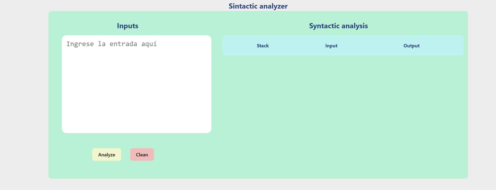

## 🌿 Analizador Sintáctico (Implementación usando Objetos)

🍀 En esta práctica se utilizo una pila de objetos, se creo una clase ElementoPila, y 3 mas que heredan de esta clase las cuales son **Terminal, NoTerminal y Elemento**.

- [Clase Elemento pila](./ElementoPila.js)

🍃 Despues de esto se cargo la gramatica en una tabla **LR(1)**.

- [Gramatica](./Gramatica.js)

🌱 Posteriormente se creo una **funcion para analizar la entrada**, esto usando el analizador lexico para determinar los tokens y despues ya proceder con el algoritmo del analisis sintactico.

- [Funcion para el analisis sintactico](./Analyze.js)

🌳 Finalmente solo se crea una **interfaz grafica** para renderizar la informacion del analisis.

- [Componente que renderiza los datos del analisis.](./sintactic.jsx)

### 📷 Imagenes del funcionamiento del programa

1. Inicio de la pagina

    

2. Interfaz del analizador sintactico

    

3. Funcionamiento del analizador sintactico

    

-----
Edwin Cornejo 💚👨🏻‍💻
