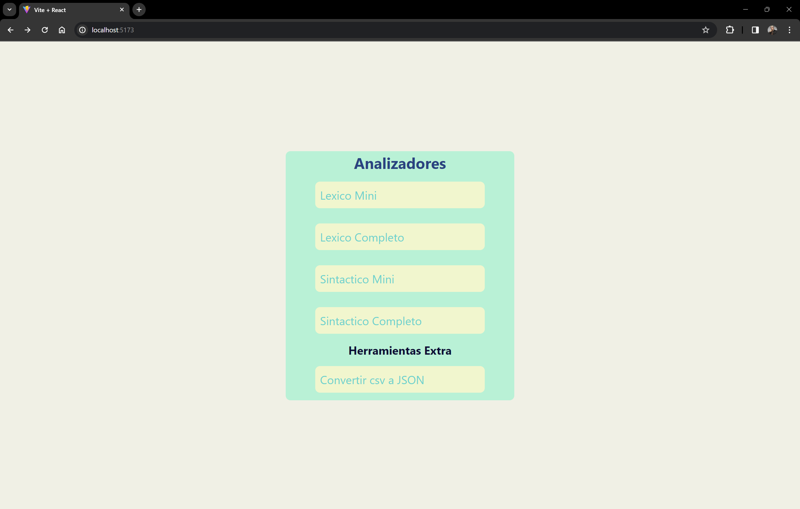
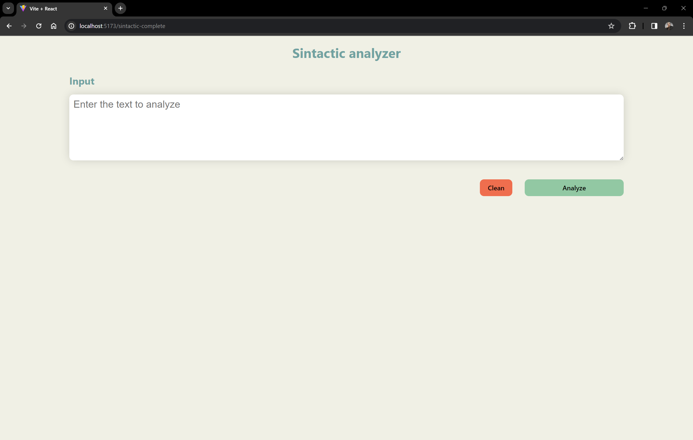
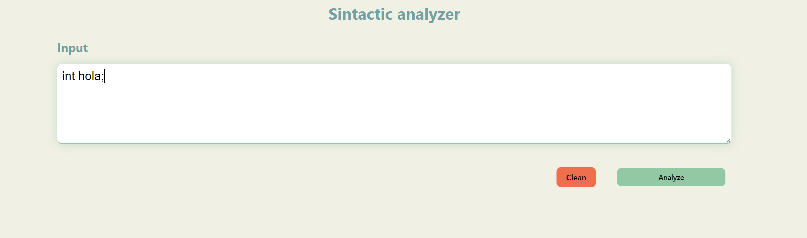
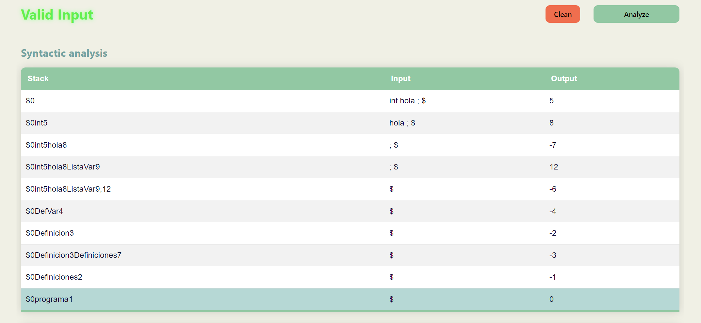
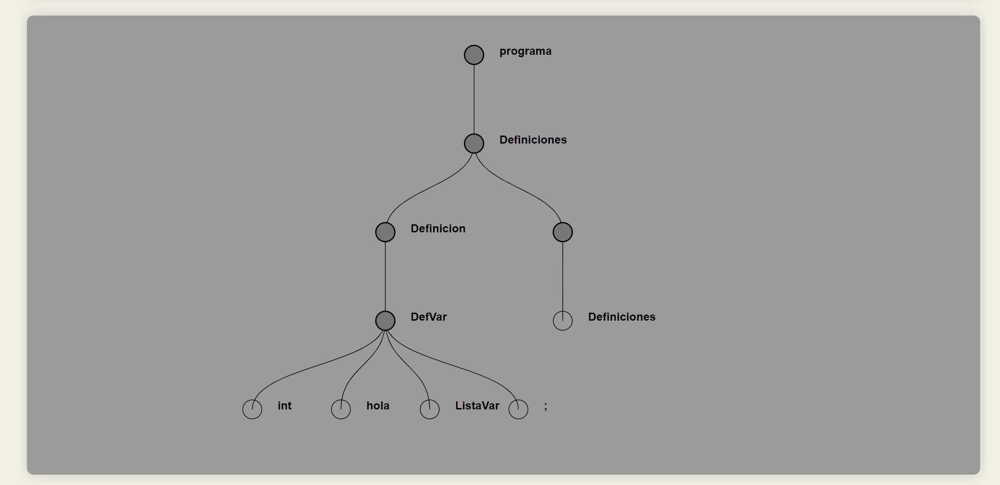
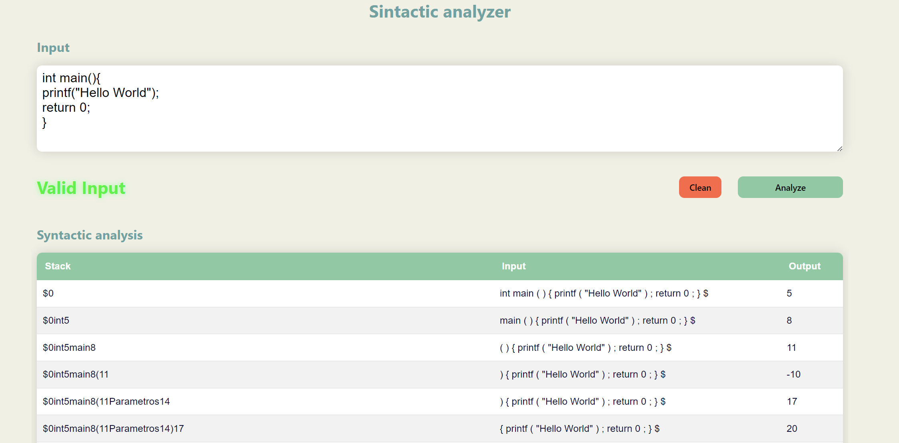
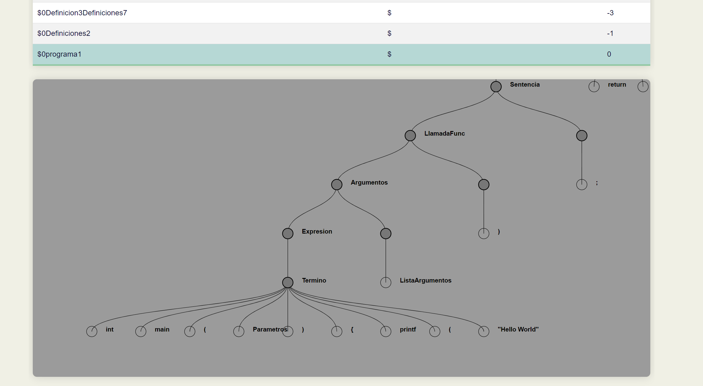
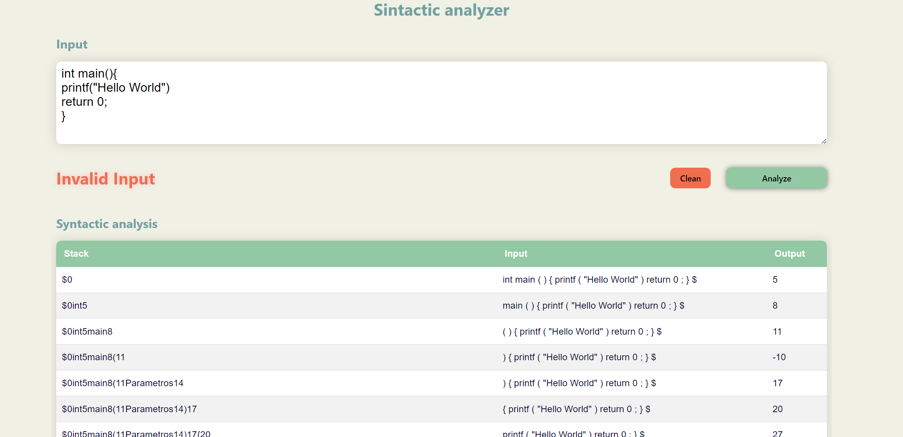
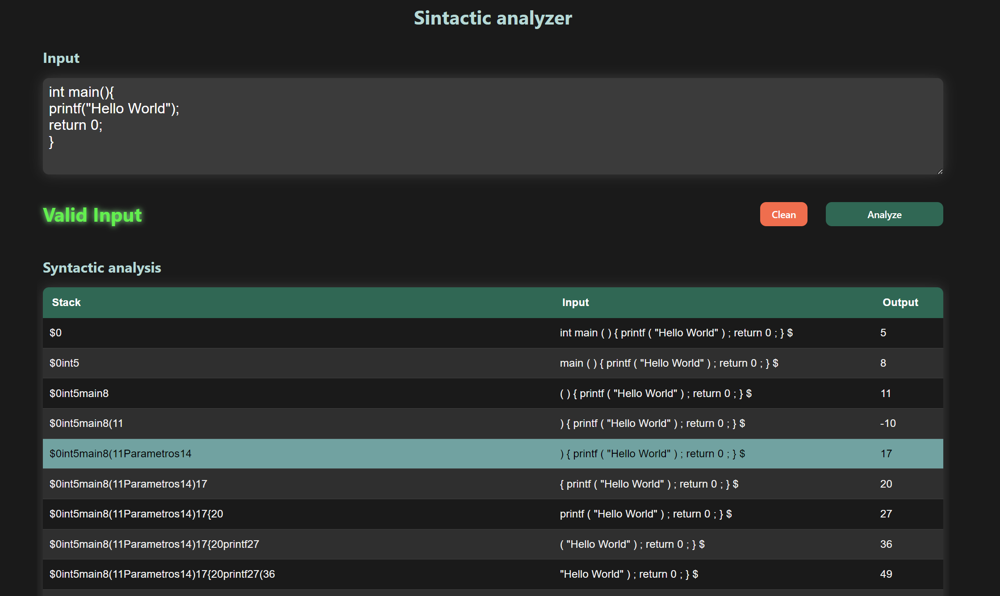

## 🌿 Analizador sintactico Completo

🍀 Un analizador sintáctico, también conocido como parser, es una herramienta en el campo de la lingüística computacional que se utiliza para analizar la estructura gramatical de una secuencia de palabras dentro de un texto, con el objetivo de comprender la sintaxis subyacente. Este proceso implica descomponer la cadena de palabras en unidades gramaticales y determinar cómo se relacionan entre sí según las reglas de la gramática de un idioma específico. El analizador sintáctico facilita la comprensión de la jerarquía gramatical y la organización de las palabras en frases, oraciones y párrafos, lo que es esencial en la construcción de aplicaciones de procesamiento del lenguaje natural, como traducción automática, análisis de sentimientos y generación de texto. 📗

**✅ Para realizar este analizador se uso:**

🍃 El Analizador lexico que se desarrollo anteriormente, ya que este nos devuelve la lista de los tokens que se introducieron en el campo de texto.
- [Analizador lexico](../../AnalizadorLexico/complete/)

🌱 Tambien se hizo uso de las reglas de la gramatica, para esto fue necesario convertorlas en un formato JSON ya que asi es mas facil su uso dentro de JavaScript.
- [Lista de reglas de la gramática](./Rules.js)

🌵 De la misma manera se construllo otro objeto JSON para almacenar lo que es la tabla de la gramatica, esta se usa para ir haciendo el analisis sintactico.
- [Tabla de la gramática](./Grammar.js)

🌳 Se desarrollo un algoritmo que se encarga de analizar los tokens y haciendo uso de la tabla de la gramatica se genera la expancion del analisis sintactico y tambien usa las reglas de la gramatica para hacer las reducciones.
- [Algoritmo para hacer expanciones y reducciones](./AnalyzeGrammar.js)

🪴 Finalmente se creo un componente visual para mostrar todo el procesos y los resultados del analisis.
- [Interfaz para mostrar los resultados](./SintacticPage.jsx)

### 📷 Imagenes del funcionamiento del programa

1. Inicio de la pagina. 🖍️

    

2. Interfaz del analizador Sintactico. 🖼️

    

3. Ingresamos algo de codigo en el input. ✍🏻

    

4. Al precionar el boton analizar, se nos muestra que es correcto y nos da todo el proceso. 📨

    

5. Tambien nos genera el arbol. 🌳

    

6. Podemos usar el boton de borrar y se limpia todo. 🧹

    

7. Ingresamos todo una función. 🖋️

    

8. Hace el analisis y muestra los resultados. 🌳

    

9. Le quitamos el **";"** para que marque error. ❌

    

10. La pagina tambien tiene modo oscuro, el cual se cambia dependiendo el SO. 🌃

    

-----
Edwin Cornejo 💚👨🏻‍💻