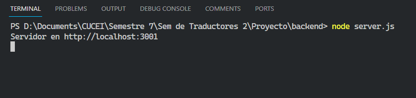
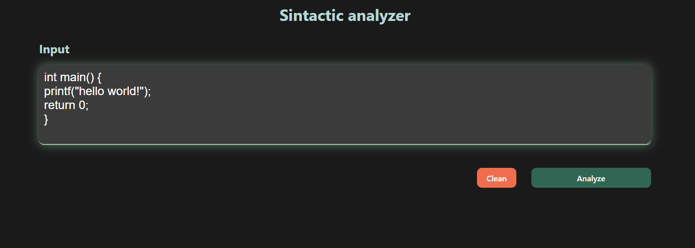
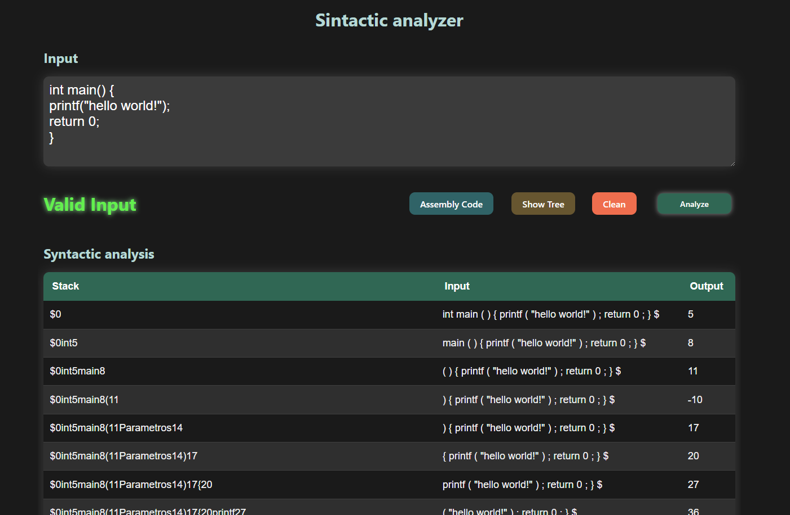
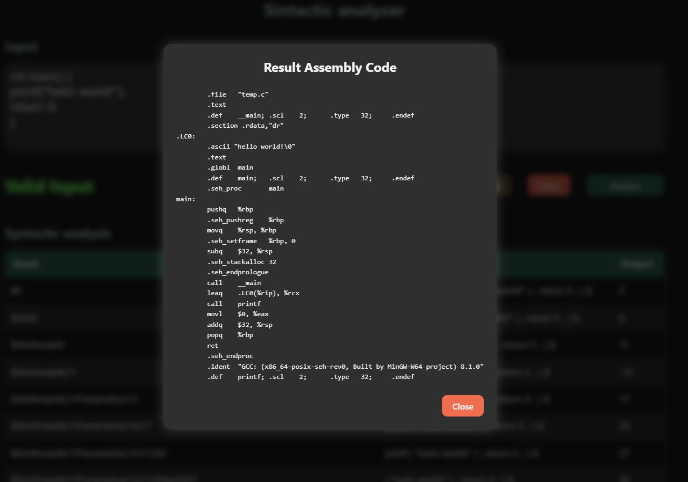
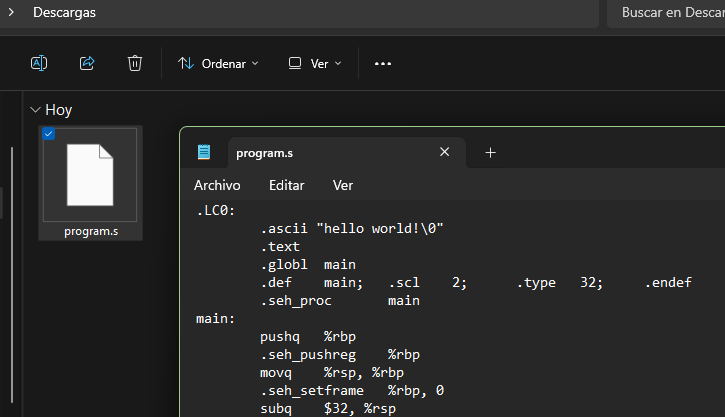
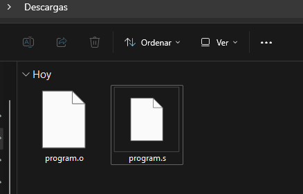
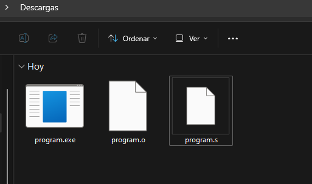

# Generacion de codigo

**✅ Para traducir el codigo de c a ensamblador se uso:**

🍃 Se creo un backend usando node.js y express, ya que este tipo de procesos no se pueden hacer en el Frontend.

```bash
npm init -y
npm install express body-parser child_process
```

🌱 Despues fue necesario levantar un servidor y crear un endpoint el cual recibe el codigo en c y este lo traduce a codigo ensamblador y lo devuelve.

- [➡️ Archivio Server.js](./server.js)

🪴 Ya con el servidor creado simplemente lo ejecutamos, usando el siguiente comando.

```bash
node server.js
```

🌿 Despues se realizo un componente en el cual se hace la peticion al servidor, esta es de tipo POST por lo que se mandan los datos en el body.

```javascript
const response = await fetch("http://localhost:3001/convert", {
  method: "POST",
  headers: {
    "Content-Type": "application/json",
  },
  body: JSON.stringify({ cCode }),
});

const result = await response.json();
```

🌳 Y despues de que se completo la peticion, los resultados se muestran en un modal en el Frontend.

- [➡️ Modal con resultados](./App.jsx)

### 📷 Imagenes del funcionamiento 

1. Inicio del servidor. 💡

    

1. Ingresamos el codigo c, en el input. 🖍️

    

1. Se analisa y si es correcto nos muestra el boton de show tree . 🌳

    

1. Al precionar el boton se muestra un modal con el codigo en ensamblador. 🧑🏻‍💻

    

**📌 Ahora se tiene que compilar dicho codigo para generar el ejecutable, para esto seguimos los siguientes pasos**

1. 🍃 Creamos un archivo program.s y dentro de este colocamos el codigo en ensamblador que nos dio nuestra pagina. 

    

1. 🌿 Abrimos una terminal y navegamos al directorio que contiene el archivo, y ejecutamos el siguiente comando para ensamblar el código:
    ```bash
    as -o program.o program.s
    ```

    **📌 Se nos va crear un archivo objeto (".o").**

    

1. ☘️ Ahora vamos a vincular el archivo objeto para crear un ejecutable. Para esto utilizamos el siguiente comando:

    ```bash
    gcc -o program program.o
    ```
    **📌 Como se puede observar se creo el .exe, es decir el ejecutable.**

    

1. 🌵 Finalmente simplemente ejecutamos el programa usando el comando: 

    ```bash
    ./programa
    ```

    **✅ El resultado seria el siguinte:**

    ```bash
    PS D:\Downloads> ./program
    hello world!
    PS D:\Downloads>
    ```

-----
Edwin Cornejo. 💚👨🏻‍💻